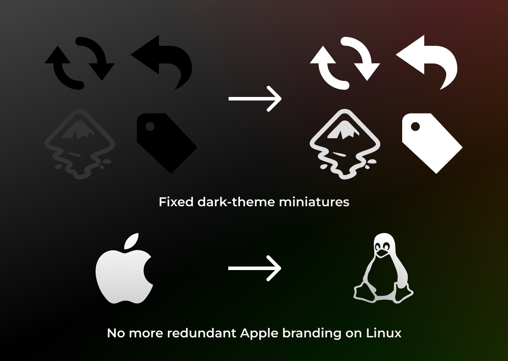
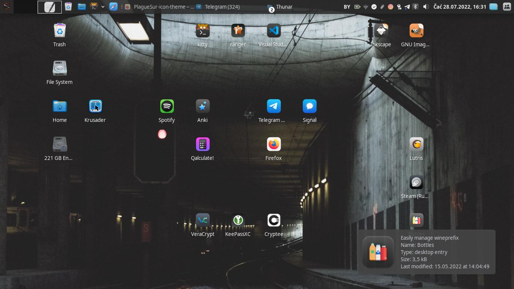

### Support me!

👋🤠 Hey, fellow wanderer! I have done a lot of work here, so you can show your apreciation for it and motivate me for further improvements by making some donation (any amount will be apreciated)!  
↓ There are different donation options, so click the button below to learn more!

<noscript><a href="https://liberapay.com/buljion"></a></noscript>  

# PlagueSur icon theme

Transform your Linux desktop into a sleek and modern interface reminiscent of iOS or Android with the PlagueSur Icon Pack. My goal is simple: to provide users with a visually stunning and intuitive icon set that enhances usability and aesthetics across all Linux desktop environments.







## What is my goal

Disclaimer: **my work is based on the other nice people's work**. Sorry if my comparisons with other icon-packs looks disrespectful, I really apreciate the contribution of every creator out there.
Let's make our desktops prettier!

I want to bring iOS or Android like experience in desktop icons at any Linux DE.

### Key principles:
- **Distinctive and Contrasting:** Each icon is crafted with easy recognition and contrast in mind.
- **Optimized for Any Resolution:** From high-density displays to standard resolutions, the icons maintain their clarity and crispness across various screen sizes.
- **Expressive and Minimalistic:** Balance between expressiveness and minimalism, eliminating clutter and enhancing focus.
- **Aesthetically-Balanced:** The icon pack is designed to deliver a harmonious and visually pleasing experience, elevating the look and feel of the user's desktop environment.
- **Neutral and Thematically Universal:** No unnecessary embellishments and distracting visuals. The icons maintain a neutral and thematically universal design, suitable for any user preference or desktop theme.

To achieve these effects my icon pack also need to cover as much icons
variations as possible, and sometimes they can be not ideal in realisation.
So I'm open for your contributions, let's make Linux to look consistent and modern!

I am not the fan of big corporations, so i'll prefer to avoid some corporational branding where it is not needed.

I've been also inspired by the Apple's
[Humman interface guidelines](https://developer.apple.com/design/human-interface-guidelines).
[These tips](https://lawsofux.com/) also helped me.

## Differentiation from Other Icon Packs

0. More icons. Some icons were fixed or redrawed completely to fit general style.
1. No unnecessary Apple branding. It was replaced with Tux logo.
2. More compatibility with dark colour scheme.

## Installation

### Manual installation from the repo

```bash
git clone https://github.com/PlagaMedicum/PlagueSur-icon-theme.git ~/.local/share/icons/PlagueSur
```

Then go the Appearance settings and choose the **PlagueSur** icon theme. Enjoy!

## TODO

- Fix colours and styles of some symbolic and low-res icons.
- Fix some little issues in high-res icons.
- Change resolutions of some icons (mostly in apps/scalable).
- Add light-themes support.
- Improve folders colour options.

Optional:
- Create some guidelines.
- Make Tux logo more distinguishable for low-res.

## Contribution

**If you found problem or want to contribute, feel free to open an issue, write some comment or create a PR!**

