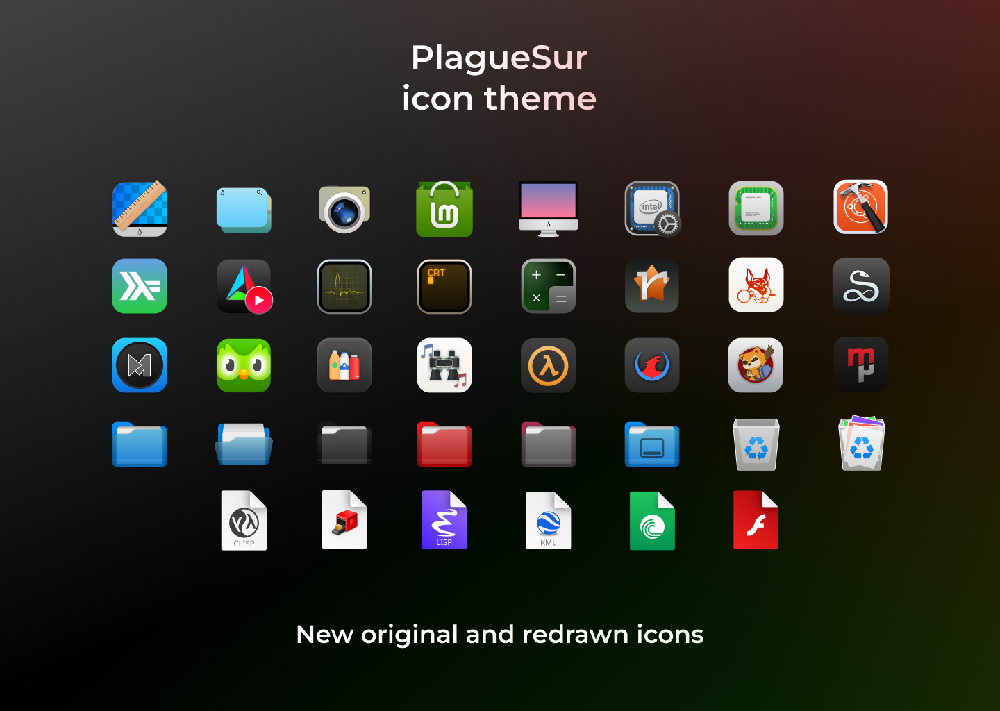

# PlagueSur icon theme




Nice dark icon theme, extending the WhiteSur-Dark theme.
This is an extension of the WhiteSur icon theme, so i recommend
to install both themes. But it'll also work mostly fine standalone.

## What is my goal

Disclaimer: sorry if my comparisons with other icon-packs looks disrespectful.
My work is based on work of other creators, and I am just aiming to
improve our pretty desktops :)

I want to bring iOS or Android like experience in desktop icons at any
Linux DE.

I've been also inspired by the Apple's
[Humman interface guidelines](https://developer.apple.com/design/human-interface-guidelines).
[These tips](https://lawsofux.com/) also helped me.

So the icons must be:
- distinguishable and contrast;
- optimized for different resolutions;
- expressive;
- minimalistic;
- aesthetically-balanced and pleasing;
- emotionally and thematically neutral, no unneeded childish doodles,
old-school chaotic paintings etc.

To achieve these effects my icon pack also need to cover as much icons
variations as possible, and sometimes they can be not ideal in realisation.
So i'm open for your contributions, let's make Linux to look consistently and modern!

I am not the fan of big corporations, so i'll prefer to avoid some corporational
branding where it is no needed.

## Differences from White Sur

0. More icons. Some icons were fixed or redrawed to fit general style.
1. No unnecessary Apple branding. It was replaced with Tux logo.
2. More compatibility with dark colour scheme.

## Installation

**Important!** I recommend you to also install the
[WhiteSur-Dark icon theme](https://github.com/vinceliuice/WhiteSur-icon-theme),
so there will be a less chance of missing icons.

### Manual installation from the repo

```bash
git clone https://github.com/PlagaMedicum/PlagueSur-icon-theme.git ~/.local/share/icons/PlagueSur
```

Then go the Appearance settings and choose the **PlagueSur** icon theme.

## TODO

- Define general style, rules and create guidelines.
- Make Tux logo more distinguishable for low-res.
- Fix colours and styles of some symbolic and low-res icons.
- Fix icons that are not inhereting from WhiteSur and replaced with other resolutions.
- Fix some little issues in high-res icons.
- Change resolutions of some icons (mostly in apps/scalable).
- Add light-themes support

If you found problem or want to contribute,
feel free to open an issue or create a PR!

